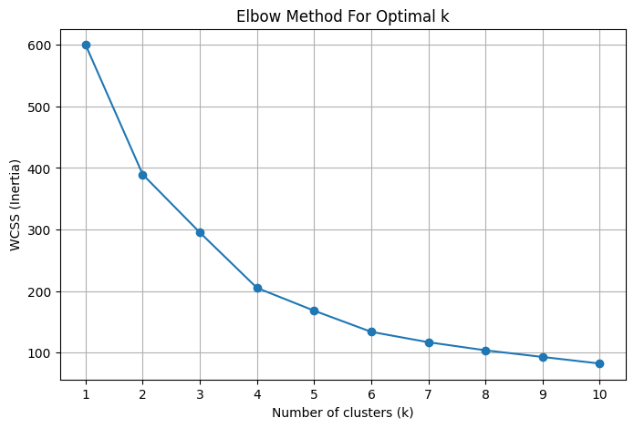
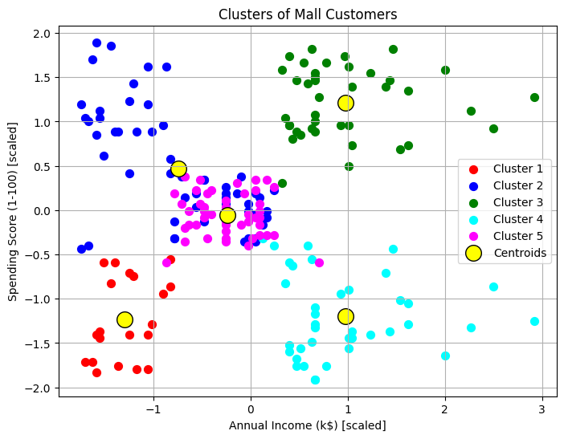
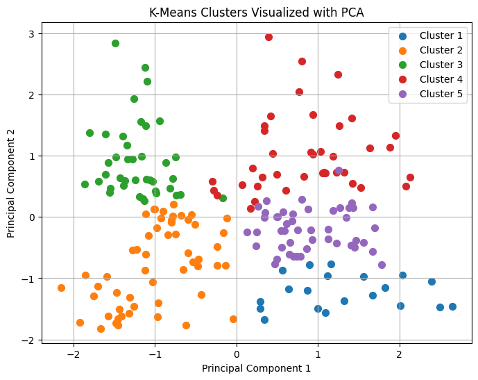

# Mall Customers K-Means Clustering

_Unsupervised customer segmentation using K-Means clustering on the Mall Customers dataset. Includes feature scaling, optimal cluster selection (Elbow Method), cluster visualization (including PCA), and evaluation with Silhouette Score._

---

## Dataset

- **File:** `Mall_Customers.csv`
- **Download Link:** https://www.kaggle.com/datasets/vjchoudhary7/customer-segmentation-tutorial-in-python
- **Features:** Age, Annual Income (k$), Spending Score (1-100)

---

## Workflow

### 1. Data Loading and Inspection
```
import pandas as pd

df = pd.read_csv('Mall_Customers.csv')
print(df.info())
print(df.head())
print(df.describe())
print(df.isnull().sum())
```
*Loaded the dataset, checked data types, summary statistics, and missing values.*

---

### 2. Data Preprocessing

- Dropped the `CustomerID` column (not useful for clustering).
- Encoded `Gender` as numeric (optional, not used for clustering here).
- Selected features: `Age`, `Annual Income (k$)`, `Spending Score (1-100)`.

Drop CustomerID
```df = df.drop('CustomerID', axis=1)```

Encode Gender (optional)
```df['Gender'] = df['Gender'].map({'Male': 0, 'Female': 1})```

Select features for clustering
```X = df[['Age', 'Annual Income (k$)', 'Spending Score (1-100)']].values```

---

### 3. Feature Scaling

*K-Means is sensitive to feature scales, so standardization is necessary.*
```
from sklearn.preprocessing import StandardScaler

scaler = StandardScaler()
X_scaled = scaler.fit_transform(X)
```

---

### 4. Elbow Method for Optimal k

*The Elbow Method helps determine the best number of clusters by plotting WCSS (inertia) for different k values.*
```
from sklearn.cluster import KMeans
import matplotlib.pyplot as plt

wcss = []
K_range = range(1, 11)
for k in K_range:
kmeans = KMeans(n_clusters=k, init='k-means++', max_iter=300, n_init=10, random_state=42)
kmeans.fit(X_scaled)
wcss.append(kmeans.inertia_)

plt.figure(figsize=(8, 5))
plt.plot(K_range, wcss, marker='o')
plt.title('Elbow Method For Optimal k')
plt.xlabel('Number of clusters (k)')
plt.ylabel('WCSS (Inertia)')
plt.xticks(K_range)
plt.grid(True)
plt.savefig('images/elbow_method.png', bbox_inches='tight')
plt.show()
```


*The "elbow" is typically at k=5, indicating 5 clusters is optimal.*

---

### 5. Fit K-Means and Assign Cluster Labels
```
kmeans = KMeans(n_clusters=5, init='k-means++', max_iter=300, n_init=10, random_state=42)
y_kmeans = kmeans.fit_predict(X_scaled)
```
*Each customer is assigned a cluster label (0–4).*

---

### 6. Cluster Visualization (2D: Annual Income vs Spending Score)

*Visualize clusters using two features for easy interpretation.*
```
plt.figure(figsize=(8,6))
plt.scatter(X_scaled[y_kmeans == 0, 1], X_scaled[y_kmeans == 0, 2], s=50, c='red', label='Cluster 1')
plt.scatter(X_scaled[y_kmeans == 1, 1], X_scaled[y_kmeans == 1, 2], s=50, c='blue', label='Cluster 2')
plt.scatter(X_scaled[y_kmeans == 2, 1], X_scaled[y_kmeans == 2, 2], s=50, c='green', label='Cluster 3')
plt.scatter(X_scaled[y_kmeans == 3, 1], X_scaled[y_kmeans == 3, 2], s=50, c='cyan', label='Cluster 4')
plt.scatter(X_scaled[y_kmeans == 4, 1], X_scaled[y_kmeans == 4, 2], s=50, c='magenta', label='Cluster 5')
plt.scatter(kmeans.cluster_centers_[:, 1], kmeans.cluster_centers_[:, 2], s=200, c='yellow', label='Centroids', edgecolors='black')
plt.title('Clusters of Mall Customers')
plt.xlabel('Annual Income (k$) [scaled]')
plt.ylabel('Spending Score (1-100) [scaled]')
plt.legend()
plt.grid(True)
plt.savefig('images/kmeans_clusters.png', bbox_inches='tight')
plt.show()
```



---

### 7. PCA for 2D Cluster Visualization

*PCA reduces the data to 2 principal components for a more general 2D view of clusters.*
```
from sklearn.decomposition import PCA

pca = PCA(n_components=2)
X_pca = pca.fit_transform(X_scaled)

plt.figure(figsize=(8,6))
for cluster in range(5):
plt.scatter(
X_pca[y_kmeans == cluster, 0],
X_pca[y_kmeans == cluster, 1],
label=f'Cluster {cluster+1}',
s=50
)
plt.title('K-Means Clusters Visualized with PCA')
plt.xlabel('Principal Component 1')
plt.ylabel('Principal Component 2')
plt.legend()
plt.grid(True)
plt.savefig('images/pca_clusters.png', bbox_inches='tight')
plt.show()
```


---

### 8. Evaluate Clustering with Silhouette Score

*Silhouette Score measures how well each point fits within its cluster (ranges from -1 to 1).*
```
from sklearn.metrics import silhouette_score

score = silhouette_score(X_scaled, y_kmeans)
print("Silhouette Score for k=5:", score)
```
*Silhouette Score for k=5: **0.42** (Reasonable, interpretable clusters)*

---

## Key Insights

- **K-Means identified 5 distinct customer segments.**
- **PCA visualization and Silhouette Score confirm clusters are reasonably well-defined.**
- **This segmentation can help businesses target different customer groups more effectively.**

---

**Author:** Saksham Bindal


